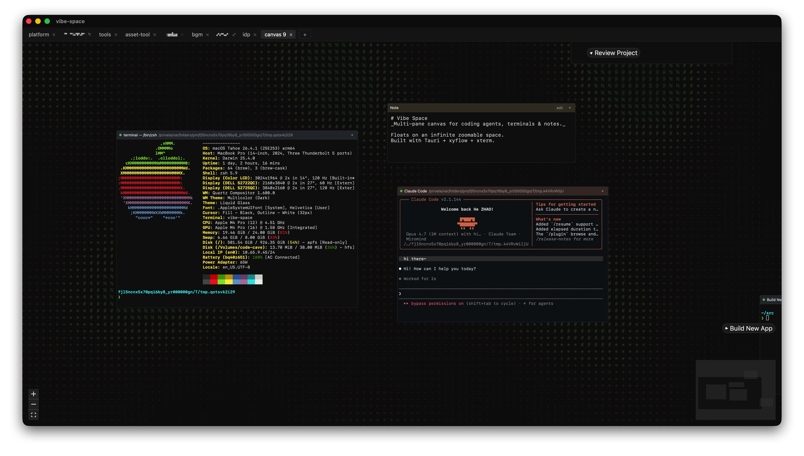

# Vibe Space

> Multi-pane infinite canvas for coding agents, terminals, and notes.

<p align="center">
  
</p>

Vibe Space is a desktop scratchpad for AI-assisted coding. Float `claude`, `codex`, terminals, and notes on a pan-and-zoom canvas; flip between projects via tabs; let long-running sessions keep churning while you focus elsewhere on the page.

Built with Tauri 2 + React 19 + [xyflow](https://github.com/xyflow/xyflow) + [xterm.js](https://github.com/xtermjs/xterm.js). macOS for now.

## Features

- **Multi-pane canvas** — drop Claude Code, OpenAI Codex, plain terminals, or Markdown notes anywhere; drag, resize, rename, organize by spatial layout instead of tabs.
- **Multiple canvases via tabs** — one canvas per project / context. Pan + zoom is saved per canvas; reordering is drag-to-rearrange.
- **Session-aware agents** — Claude Code panes follow `--resume` semantics across app restarts, including `-w <worktree>` mode. Sessions are auto-rebound after the underlying jsonl rotates.
- **Live + persistent PTYs** — backed by a Rust supervisor; scrollback rings flush to SQLite every second so closing/reopening a pane never loses output. Per-pane shell history (`HISTFILE`).
- **Animated backgrounds** — ASCII waves, plasma, matrix, rain, starfield, classic dots, or off. Viewport-aware, gracefully degrades when zoomed out.
- **Off-screen indicators** — renamed panes that drift outside the viewport leave a breathing edge marker that pulses when they have unread output.
- **System tray + close-to-tray** — closing the window keeps all PTYs alive in the background; click the tray to come back.
- **Native macOS menubar** — themed pane tints, custom Quit confirmation that warns about live PTYs before exit.

## Install

### From source

Requires [Rust](https://rustup.rs/), Node 20+, and Xcode command-line tools.

```sh
git clone https://github.com/callmemhz/vibe-space.git
cd vibe-space
npm install
npm run tauri build
```

The built app lands at `src-tauri/target/release/bundle/macos/vibe-space.app`. Drag it into `/Applications`.

### Dev mode

```sh
npm run tauri dev
```

## Status

Pre-1.0, single-author project. Most edges are macOS-only (cwd tracking via `lsof`, native menus, tray icon assumptions). Linux + Windows builds will compile via Tauri but some platform-specific behavior is unverified.

## Tech stack

| Layer | What | Why |
| --- | --- | --- |
| Shell | Tauri 2 | Native window, tray, menubar, IPC. Smaller than Electron. |
| Canvas | @xyflow/react 12 | Pan/zoom + node graph primitives. |
| Terminal | @xterm/xterm 6 | Per-pane TTY rendering. |
| State | Zustand 5 | Small client store; persistence layer talks to Rust over Tauri commands. |
| Persistence | SQLite (`rusqlite`) | Canvases, nodes, scrollback, app_state. |
| Process | `portable-pty` | Cross-platform PTY for shells + agents. |

## License

TBD (intent: MIT). See [LICENSE](LICENSE) when it lands.
